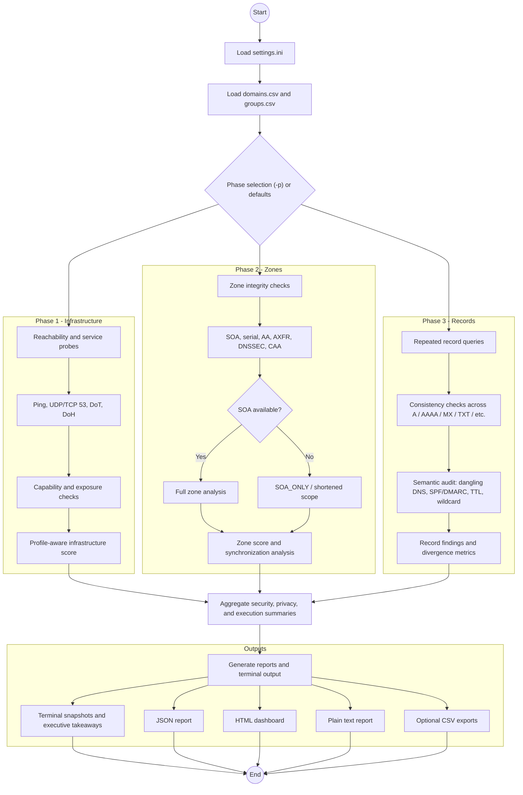

# FriendlyDNSReporter
> *Because it is always DNS. Or not. But mostly yes.*

[](https://www.python.org/)
[-green.svg)]()
[]()

Does your boss ask for "evidence" that DNS is broken?
Do you enjoy typing `dig` 5,000 times a day?
Do you like staring at raw text output until your eyes bleed?

**No?** Then `FriendlyDNSReporter` is for you.

This tool provides parallel DNS diagnostics for **Windows** and **Linux**, with terminal summaries, structured reports, and an HTML dashboard.

## Features

* **Observability Upgrade (v6.9.4)**: Phase 1 and Phase 2 now retain richer probe evidence, repeatability, jitter, and scope confidence.
* **Operational Console (v6.9.4)**: Improved terminal snapshots, inline progress, executive takeaways, and export-safe output.
* **Plain Text Report Export (v6.9.4)**: Generates a `.txt` report for tickets, copy/paste, and offline review.
* **Forensic Analysis Console (v6.9.0)**: HTML dashboard with search, incident focus, interpretation help, and trend charts.
* **Professional JSON Reporting (v6.8.0)**: Hierarchical output with execution metadata and system info for automation.
* **Extended Forensic Legends**: Definitions for status markers, metrics, and scoring.
* **Granular Forensic Scoring**: Individual infrastructure and zone health scores.
* **Selective Diagnostics**: Run only the phases you need with `-p`.
* **3-Phase Circuit Breaker**: Dead or unreachable services can be skipped in later phases.
* **Semantic DNS Audit**: Dangling DNS, wildcard detection, SPF/DMARC heuristics, TTL review, and MX checks.

## Logic Flow



## Installation

1. Clone the repository:
```bash
git clone https://github.com/flashbsb/FriendlyDNSReporter.git
cd FriendlyDNSReporter
```

2. Install dependencies:
```bash
python -m pip install -r requirements.txt
```

3. Run the script:
```bash
python friendly_dns_reporter.py
```

If dependencies are missing, the script will ask before attempting any automatic installation. In non-interactive mode it will only print the manual installation command unless `--install-missing-deps` is explicitly provided.

## Usage

### Basic Execution

```bash
python friendly_dns_reporter.py
```

### Advanced Examples

```bash
# Run only Phase 1 (Infrastructure) and Phase 3 (Records)
python friendly_dns_reporter.py --phases 1,3

# Use custom datasets
python friendly_dns_reporter.py -n my_domains.csv -g my_groups.csv

# Save reports to a custom output directory
python friendly_dns_reporter.py -o reports

# Run only the Zone phase
python friendly_dns_reporter.py --phases 2
```

### Command Flags

| Flag | Description |
|------|-------------|
| `--phases` | Select phases to run (for example `1`, `1,2,3`). Default: configured in `settings.ini`. |
| `-n`, `--domains` | Path to the domains CSV. Default: `config/domains.csv`. |
| `-g`, `--groups` | Path to the groups CSV. Default: `config/groups.csv`. |
| `-o`, `--output` | Output directory for generated reports. |
| `--install-missing-deps` | Explicitly allow automatic installation of missing Python dependencies. |
| `-h`, `--help` | Show command help. |

Parallelism, consistency count, timeouts, scoring weights, and feature toggles are centralized in `config/settings.ini`.

## Configuration

The `config/settings.ini` file gives you full control over the diagnostic engine:

- **[GENERAL]**: `MAX_THREADS`, `WATCHDOG_INTERVAL`, and default file paths.
- **[REPORTS]**: Toggles for HTML, JSON, CSV, and TXT exports. Enable `ENABLE_SECURITY_SCORE` and `ENABLE_PRIVACY_SCORE` for forensic analysis.
- **[DNS_ENGINE]**: `DNS_TIMEOUT`, `DNS_RETRIES`, and `DOH_VERIFY_SSL` for engine tuning.
- **[SCORING_WEIGHTS]**: Customize the impact of DNSSEC, DoH, DoT, QNAME Minimization, and more on final health scores.
- **[AUDIT_THRESHOLD]**: Define heuristic limits for TTL and SPF lookups.
- **[CONSISTENCY]**: Configure Phase 3 depth and latency warnings (`REC_LATENCY_WARN`, `REC_LATENCY_CRIT`).

## Forensic Scoring System

The tool calculates two primary health indices:

1.  **Security Score**: Evaluates encryption (DoH/DoT), DNSSEC, Cookies, and port exposure (Web Risk).
2.  **Privacy Score**: Evaluates protocol masking (DoH/DoT), QNAME Minimization, and ECS masking.

Scores are aggregated across all tested servers and converted into an executive **Letter Grade (A+ to F)**.

## Reports

The tool can generate:

- `JSON`: full structured report used by the dashboard and the richest machine-readable output.
- `HTML`: interactive forensic dashboard. When HTML is enabled, JSON is generated as its backing data source.
- `TXT`: optional plain text report for copy/paste and attachments.
- `CSV`: optional phase detail and summary exports.

## Technical Glossary

| Status | Phase | Meaning |
|--------|-------|---------|
| `OK` | All | Service or check completed successfully. |
| `P_ONLY` | 1 | Port is open, but the DNS service did not behave like a healthy responder. |
| `DIV!` | 3 | Repeated checks returned materially different answers. |
| `LAME` | 2 | The server is expected to be authoritative but did not behave authoritatively. |
| `XFR-OK` | 2 | AXFR was allowed, which may expose the zone. |
| `REFUSED` / `NO_RECURSION` | 1 | Recursion appears restricted rather than publicly exposed. |
| `OPEN` | 1 | The server answered a third-party recursive request and may be publicly exposed. |

## Input Files

The loader automatically detects `;`, `,`, and tab-delimited CSV input.

### `config/groups.csv`

```csv
# NAME;DESCRIPTION;TYPE;TIMEOUT;SERVERS
GOOGLE;Google Public DNS;recursive;2;8.8.8.8,8.8.4.4
OPENDNS;Cisco OpenDNS;recursive;3;208.67.222.222,208.67.220.220
```

The `TYPE` column is used to decide whether recursion should be requested for that group.

### `config/domains.csv`

```csv
# DOMAIN;GROUPS;RECORDS;EXTRA
google.com;GOOGLE,CLOUDFLARE;A,AAAA,TXT;www,mail
wikipedia.org;QUAD9,OPENDNS;A,SOA;
```

## Contributing

Found a bug or want to improve the diagnostics? Pull requests are welcome.

## License

MIT. Use it as you wish, just do not blame the tool if your DNS misbehaves.

## Legal Disclaimer

This script is like a horoscope for your DNS: based on facts, interpreted by algorithms, and subject to the mood of the network gods. By running it, you accept that:

1. **Responsibility? Zero.** If your DNS explodes, your internet vanishes, or your cat learns COBOL because of this script, it is on you.
2. **The Journey is Dark.** The script analyzes what it receives but cannot know who interfered with the path.
3. **Scores are just numbers.** They are guidance, not absolute truth.
4. **Technological hallucinations happen.** Results are a snapshot in time.
5. **Use at your own risk.** DNS is still DNS.
