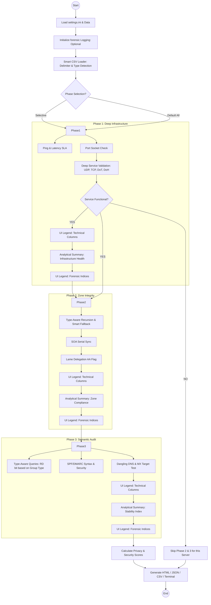

# FriendlyDNSReporter
> *Because it is always DNS. Or not. But mostly yes.*

[](https://www.python.org/)
[-green.svg)]()
[]()

Does your boss ask for "evidence" that the DNS is broken? 
Do you enjoy typing `dig` 5,000 times a day? 
Do you like staring at raw text output until your eyes bleed?

**No?** Then `FriendlyDNSReporter` is for you.

This tool has been completely rewritten in Python to ensure native compatibility between **Windows** and **Linux**, providing fast, parallel diagnostics and modern visual reports.

## 🚀 Features (Buzzwords)

*   **Extended Forensic Legends (v6.5.0)**: Exhaustive definitions for PING, technical statuses, and scoring weights.
*   **Triple Double Legend System (v6.4.0)**: Sequential legends (Technical Table -> Analysis Summary) for every phase.
*   **Analytical Legends (v6.3.0)**: Contextual explanations for forensic indices.
*   **Granular Forensic Scoring (v6.2.0)**: Individual Server and Zone health scores (0-100).
*   **Auditor Intelligence (v6.1.0)**: Advanced analytical insights (Adoption rates, Sync health, Stability Index).
*   **Privacy & Security Scoring (v6.0.0)**: Forensic markers assessment (ECS, QNAME-M, Cookies, CAA, DNSSEC).
*   **Forensic Execution Logging**: Detailed recording of every diagnostic event for technical analysis.
*   **Interactive Terminal Legends (v5.2.0)**: Automatic legends after each phase explaining columns and colors.
*   **Deep Service Validation (v5.0.0)**: Differentiates between Port status (socket) and Service status (real DNS response) for UDP, TCP, DoT, and DoH.
*   **Smart Loader (v5.0.0)**: Automatic detection of CSV delimiters (`,` or `;`) and Type-aware queries (Recursive vs. Authoritative).
*   **Selective Diagnostics**: Run only the phases you need using CLI flags (`-p 1,3`).
*   **3-Phase Circuit Breaker**: Phase 1 acts as a gatekeeper; if a service is truly down, the script skips subsequent phases to save time.
*   **Semantic DNS Audit (v4.0.0)**: SPF/DMARC validation, Dangling DNS detection, MX reachability, and Wildcard mapping.
*   **Performance Tracking (v4.1.0)**: Configurable latency thresholds (WARN/CRIT) across all phases.
*   **Premium Dashboard**: Modern responsive HTML reports with charts and detailed findings.

## 📊 Logic Flow



## 📦 Installation

1.  Clone the repository:
    ```bash
    git clone https://github.com/flashbsb/FriendlyDNSReporter.git
    cd FriendlyDNSReporter
    ```

2.  Dependencies are now installed **automatically** during the first run. Just execute the script:
    ```bash
    python friendly_dns_reporter.py
    ```

## 🎮 Usage

### Basic Execution
The script uses files in the `config/` directory by default:
```bash
python friendly_dns_reporter.py
```

### Advanced Examples
```bash
# Run only Phase 1 (Infrastructure) and Phase 3 (Records)
python friendly_dns_reporter.py -p 1,3

# Using custom datasets and 20 parallel threads
python friendly_dns_reporter.py -n my_dataset.csv -t 20

# Running a consistency loop (repeats each test 3 times)
python friendly_dns_reporter.py -c 3
```

### Command Flags

| Flag | Description |
|------|-------------|
| `-p` | **Phases**. Select phases to run (e.g., `1`, `1,3`, `2`). Default: All. |
| `-n` | **Domains CSV**. Path to domains file (Default: `config/domains.csv`). |
| `-g` | **Groups CSV**. Path to server groups file (Default: `config/groups.csv`). |
| `-o` | **Output**. Directory to save reports (Default: `logs`). |
| `-t` | **Threads**. Parallel execution count (Default: 10 or from `.ini`). |
| `-c` | **Consistency**. Number of repetitions per test to detect divergence. |
| `-h` | **Help**. Show available options. |

## ⚙️ Configuration (`config/settings.ini`)

The `settings.ini` file centralizes script behavior:
- `ENABLE_PHASE_*`: Toggle Infrastructure, Zone, or Record phases independently.
- `MAX_THREADS`: Parallelism limit.
- `DNS_TIMEOUT` / `DNS_RETRIES`: Native engine execution parameters.
- `LOG_DIR`: Directory where reports are saved.
- `STRICT_*_CHECK`: Define tolerance for record consistency (IP, TTL, Order).

## 📄 Input Files

The script now features a **Smart Loader (v5.0.0)** that automatically detects the delimiter (`;` or `,`).

### `config/groups.csv`
```csv
# NAME;DESCRIPTION;TYPE;TIMEOUT;SERVERS
GOOGLE;Google Public DNS;recursive;2;8.8.8.8,8.8.4.4
OPENDNS;Cisco OpenDNS;recursive;3;208.67.222.222,208.67.220.220
```
> [!NOTE]
> The `TYPE` column (recursive/iterative) is used to automatically set the recursion bit in DNS queries.

### `config/domains.csv`
```csv
# DOMAIN;GROUPS;RECORDS;EXTRA
google.com;GOOGLE,CLOUDFLARE;A,AAAA,TXT;www,mail
wikipedia.org;QUAD9,OPENDNS;A,SOA;
```

## 🤝 Contributing

Found a bug? Have a cool feature to add?
Please open a Pull Request. We appreciate any help maintaining this "mostly DNS" diagnostic tool.

## 📜 License

MIT. Use it as you wish, just don't blame us if it breaks your DNS.
